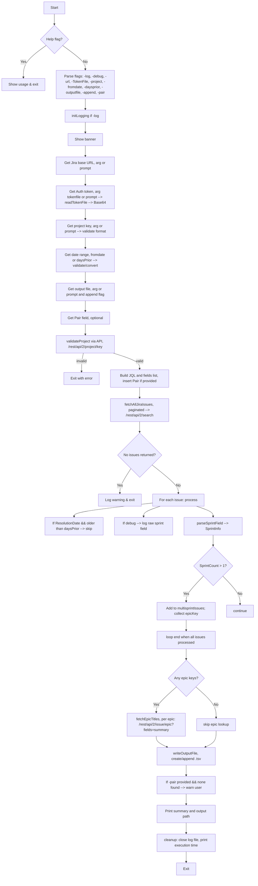
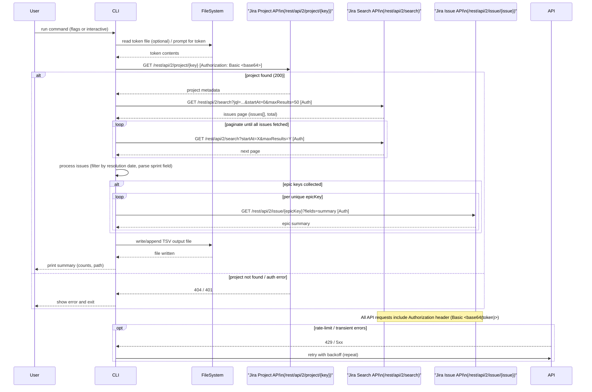

# Program Diagrams

## Logical flow

```mermaid
flowchart TD
  A[Start] --> B{Help flag?}
  B -- Yes --> ShowUsage[Show usage & exit]
  B -- No --> C[Parse flags: -log, -debug, -url, -TokenFile, -project, -fromdate, -daysprior, -outputfile, -append, -pair]
  C --> D[initLogging if -log]
  D --> E[Show banner]
  E --> F[Get Jira base URL, arg or prompt]
  F --> G[Get Auth token, arg tokenfile or prompt --> readTokenFile --> Base64]
  G --> H[Get project key, arg or prompt --> validate format]
  H --> I[Get date range, fromdate or daysPrior --> validate/convert]
  I --> J[Get output file, arg or prompt and append flag]
  J --> K[Get Pair field, optional]
  K --> L[validateProject via API, /rest/api/2/project/key]
  L -- invalid --> M[Exit with error]
  L -- valid --> N[Build JQL and fields list, insert Pair if provided]
  N --> O[fetchAllJiraIssues, paginated --> /rest/api/2/search]
  O --> P{No issues returned?}
  P -- Yes --> Q[Log warning & exit]
  P -- No --> R[For each issue: process]
  R --> R1[If ResolutionDate && older than daysPrior --> skip]
  R --> R2[If debug --> log raw sprint field]
  R --> R3[parseSprintField --> SprintInfo]
  R3 --> R4{SprintCount > 1?}
  R4 -- Yes --> S[Add to multisprintIssues; collect epicKey]
  R4 -- No --> T[continue]
  S --> U[loop end when all issues processed]
  U --> V{Any epic keys?}
  V -- Yes --> W[fetchEpicTitles, per epic: /rest/api/2/issue/epic?fields=summary]
  V -- No --> X[skip epic lookup]
  W --> Y[writeOutputFile, create/append .tsv]
  X --> Y
  Y --> Z[If -pair provided && none found --> warn user]
  Z --> AA[Print summary and output path]
  AA --> BB[cleanup: close log file, print execution time]
  BB --> End[Exit]
```

## API sequence interaction

```mermaid
sequenceDiagram
  participant User
  participant CLI
  participant FS as FileSystem
  participant ProjectAPI as "Jira Project API\n(/rest/api/2/project/{key})"
  participant SearchAPI as "Jira Search API\n(/rest/api/2/search)"
  participant IssueAPI as "Jira Issue API\n(/rest/api/2/issue/{issue})"

  User->>CLI: run command (flags or interactive)
  CLI->>FS: read token file (optional) / prompt for token
  FS-->>CLI: token contents
  CLI->>ProjectAPI: GET /rest/api/2/project/{key} [Authorization: Basic <base64>]
  alt project found (200)
    ProjectAPI-->>CLI: project metadata
    CLI->>SearchAPI: GET /rest/api/2/search?jql=...&startAt=0&maxResults=50 [Auth]
    SearchAPI-->>CLI: issues page (issues[], total)
    loop paginate until all issues fetched
      CLI->>SearchAPI: GET /rest/api/2/search?startAt=X&maxResults=Y [Auth]
      SearchAPI-->>CLI: next page
    end
    CLI->>CLI: process issues (filter by resolution date, parse sprint field)
    alt epic keys collected
      loop per unique epicKey
        CLI->>IssueAPI: GET /rest/api/2/issue/{epicKey}?fields=summary [Auth]
        IssueAPI-->>CLI: epic summary
      end
    end
    CLI->>FS: write/append TSV output file
    FS-->>CLI: file written
    CLI-->>User: print summary (counts, path)
  else project not found / auth error
    ProjectAPI-->>CLI: 404 / 401
    CLI-->>User: show error and exit
  end

  Note over SearchAPI,IssueAPI: All API requests include Authorization header (Basic <base64(token)>)
  opt rate-limit / transient errors
    API-->>CLI: 429 / 5xx
    CLI->>API: retry with backoff (repeat)
  end
```
